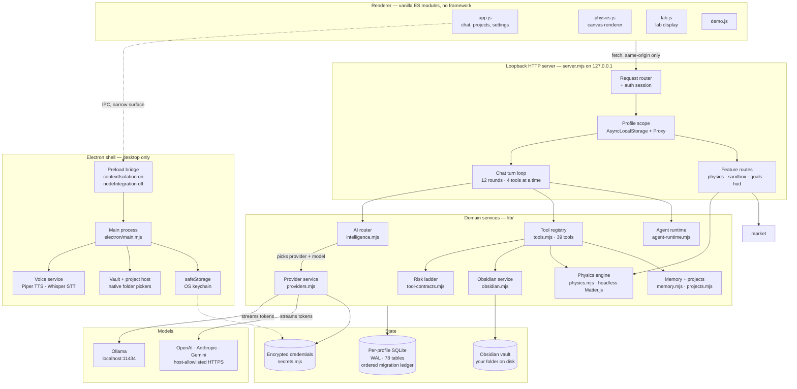
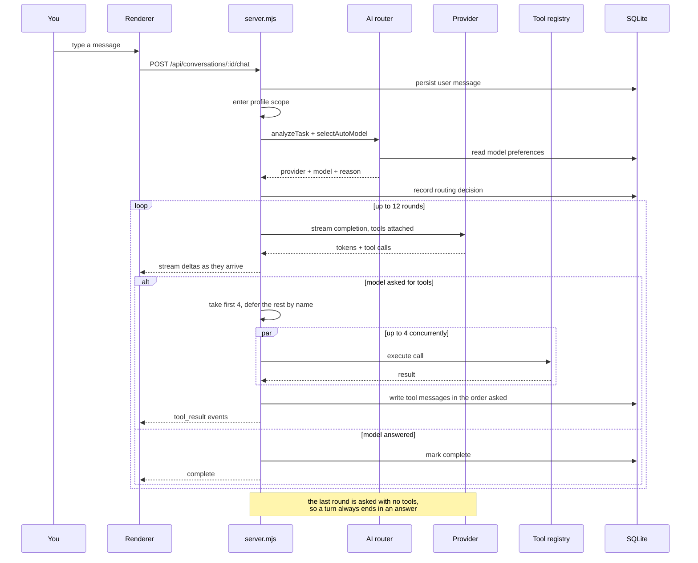
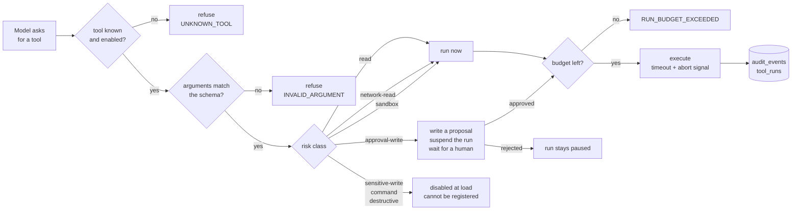
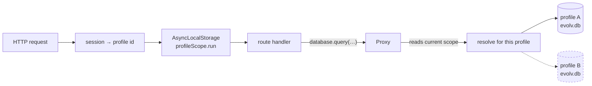
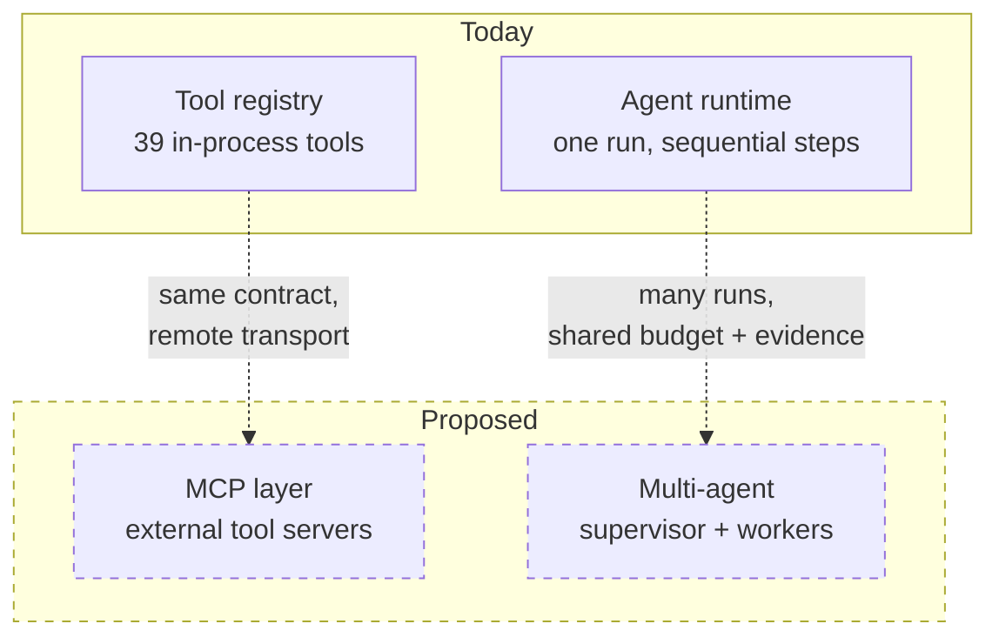

# Evolv — architecture

How the pieces fit, drawn from the code rather than from memory. Every box below
exists in the repository; the two that don't are in [Not built yet](#not-built-yet)
and are drawn dashed so nobody mistakes a plan for a component.

**Two corrections to the usual description of this app.** There is **no React** —
the renderer is plain ES modules under `public/`, no framework, no build step.
And there is **no MCP layer** — tools are defined in-process against a local
contract registry (`lib/tool-contracts.mjs`). Both would be additions, not
descriptions.

---

## 1. System map

The load-bearing idea: the renderer holds no state that matters and no
credentials. It draws, and it asks a loopback HTTP server on `127.0.0.1` for
everything else. Every domain service sits behind that boundary, on the Node
side, where the database and the keys are.

**Why the physics engine is on the server side and not in the canvas.** So that
"what is in the scene?" has one answer. If the simulation lived in the page, the
question would really mean "what does some open tab currently believe", and
asking with no window open would answer "nothing". The engine runs headless, the
model reads the same bodies the solver just moved, and the canvas receives
already-solved polygons to draw. A fixed timestep makes the same scene run twice
give identical results — the difference between an experiment and an animation.

---

## 2. Data flow — one chat turn

This is the path a single message takes. The loop is the part worth reading
closely: the model can come back asking for tools up to twelve times, and each
round runs at most four of them.

Three details that are easy to get wrong and are deliberate here:

- **Results are recorded in the order the model asked**, not the order they
  finished. Concurrency must not reorder the transcript.
- **Deferred calls are named back to the model** — "these were not run and have
  no result: …" — rather than dropped. Dropping them silently is how a model ends
  up describing ten objects when only six exist.
- **The final round is asked with no tools at all**, so running out of rounds
  produces an answer instead of an error about a limit the user never saw.

---

## 3. Permissions — what a tool call has to pass

Every tool declares a risk class. Three tiers run on their own; one raises an
approval and suspends the run; three are compiled out entirely and refuse to
even register.

The tiers, from `lib/tool-contracts.mjs`:

| Risk class | Runs automatically | Effect | Enabled |
|---|---|---|---|
| `read` | yes | local read | yes |
| `network-read` | yes | bounded network read | yes |
| `sandbox` | yes | writes inside a disposable sandbox | yes |
| `approval-write` | **no** | proposal only — a diff a human applies | yes |
| `sensitive-write` | no | real write | **no** |
| `command` | no | shell command | **no** |
| `destructive` | no | destructive | **no** |

`sandbox` is automatic on purpose: the point of simulating is that a model can
try, fail and retry without asking. The approval belongs to promoting the
result, not to the attempt.

An Obsidian edit never writes your note. It writes a *proposal* — a reviewable
diff — and the vault only changes when you approve it. That is what
`approval-write` means in practice.

---

## 4. Profile isolation

Every account gets its own database file. The mechanism is worth knowing because
it is invisible: services are not passed around as arguments, they are resolved
per request.

`database`, `toolRegistry`, `providerService` and `vaultService` are all `Proxy`
objects in `server.mjs`. Touching a property resolves it against whichever
profile owns the in-flight request. A handler cannot reach another profile's data
by accident, because it never holds a handle to one.

---

## 5. Component breakdown

| Component | Where | What it owns |
|---|---|---|
| Electron main | `electron/main.mjs` | window, permissions, IPC bridges, update service |
| Preload bridge | `electron/preload.cjs` | the only IPC surface the renderer sees — voice, vault picker, project picker, quit/update |
| Voice | `electron/voice-service.mjs` | Piper TTS and Whisper STT, both bundled, both offline |
| Renderer | `public/*.js` | chat UI, physics canvas, lab display, agent workspace, demo — vanilla ES modules |
| HTTP server | `server.mjs` | routing, auth sessions, the chat turn loop, profile scoping |
| AI router | `lib/intelligence.mjs` | reads the task, scores candidate models, picks one, records why |
| Providers | `lib/providers.mjs` | Ollama plus OpenAI, Anthropic, Gemini; capability detection; streaming |
| Tool registry | `lib/tools.mjs` | 39 tools, validation, timeouts, audit records |
| Risk ladder | `lib/tool-contracts.mjs` | the six-tier permission model above |
| Tool batching | `lib/tool-batching.mjs` | groups a round's calls into concurrent batches of four |
| Agent runtime | `lib/agent-runtime.mjs` | runs, steps, budgets, checkpoints, pause/resume, approvals |
| Goal runner | `lib/goal-runner.mjs`, `lib/goal-contracts.mjs` | plan → verify → evidence for multi-step answers |
| Escalation | `lib/goal-escalation.mjs` | decides, without calling a model, whether a message is work rather than a question |
| Specialists | `lib/agents.mjs` | the roles a plan step can be executed as, and what each may reach |
| Obsidian | `lib/obsidian.mjs`, `lib/obsidian-vault.mjs` | indexes your vault, proposes edits as diffs |
| Physics | `lib/physics.mjs`, `server/physics-routes.mjs` | headless Matter.js, perception, scene save/load |
| Sandbox | `lib/sandbox.mjs`, `server/sandbox-routes.mjs` | disposable workspace for simulated edits |
| Memory | `lib/memory.mjs` | memory nodes and edges, continual memory proposals |
| Projects | `lib/projects.mjs` | project files, tasks, knowledge chunks, grants |
| Evolution | `lib/evolution.mjs` | run evaluation, benchmark cases, failure patterns |
| Secrets | `lib/secrets.mjs` | API keys, encrypted via OS keychain on desktop |
| Schema | `lib/schema.mjs` | 78 tables, ordered migration ledger with SHA-256 checksums |

### There is no plugin system

There was one — signed `.evolvpack` files, a catalog, publisher trust, a
permission review dialog — and it was removed in 0.6.5 along with the storefront
that browsed it. It existed so that somebody could extend Evolv, and nobody was
going to. The schema migrations that created its tables are still in place,
because the ledger has to stay replayable; the tables are simply unused.

Tools are defined in-process against `lib/tool-contracts.mjs`, and the risk
ladder above is the whole permission model.

## Not built yet

Drawn dashed because they are proposals, not code.

**An MCP layer** would be a second source of tools behind the existing contract:
`defineToolContract` already normalizes name, schema, risk class and timeout, so
an MCP server's tools could be registered through the same door and inherit the
same risk ladder. The work is transport and trust — deciding what risk class a
remote tool may claim, and what happens when the server disappears mid-call.

**A multi-agent framework** has more of its groundwork in place than the tool
layer does. `agent-runtime.mjs` already models runs, steps, budgets, checkpoints
and evidence, and a run can pause and resume. What is missing is more than one
run cooperating: a supervisor that decomposes a goal, workers that hold separate
contexts, and a budget shared across them rather than per-run. The pause/resume
checkpointing is the part usually retrofitted painfully, and it already exists.

---

*Diagrams generated from the code at the commit that added this file. If a box
here stops matching `lib/`, the diagram is wrong, not the code.*
