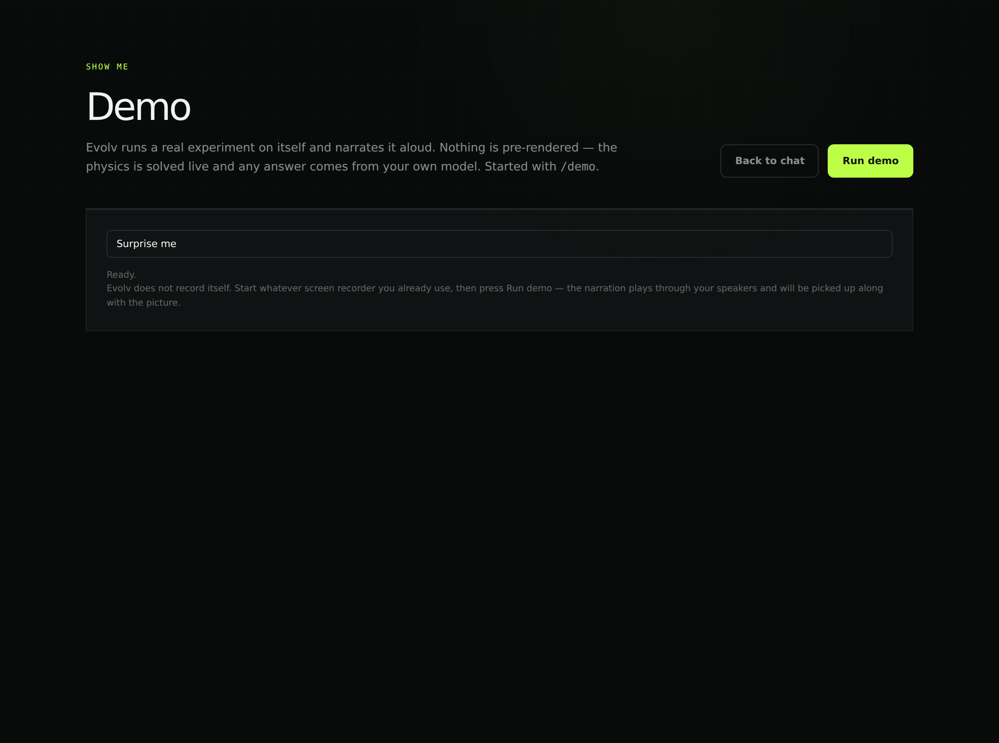
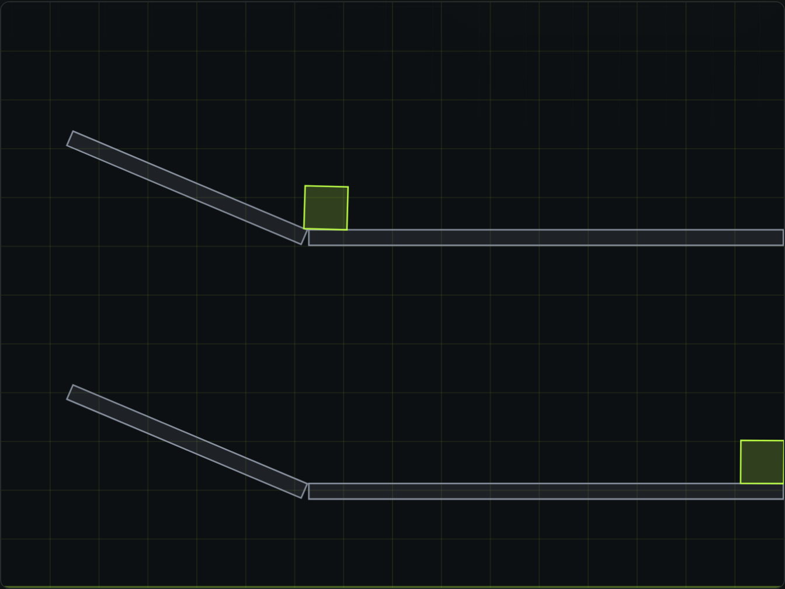
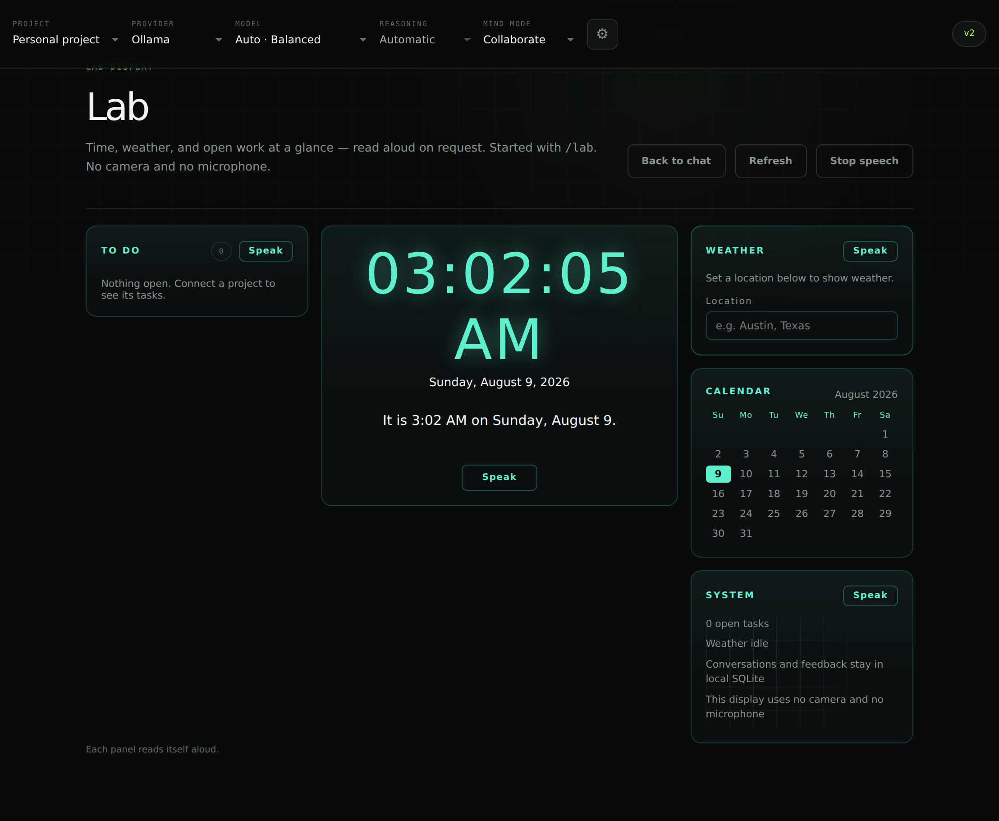

# Press one button and Evolv runs an experiment on itself

Evolv is a local-first AI chat that runs against your own models. Last time it
got a physics sandbox. This time it got a button that shows you what the thing
actually does, an installer on both Windows and Linux, and a wall-mounted lab
display.

## The Demo button

Type `/demo`, pick one or press **Run demo** for whichever it feels like, and
Evolv drives its own interface while narrating out loud. The voice is Piper,
running locally, at 1.5x — nothing is streamed to a server to make it talk.

Three of them. Two are physics, one is a real question put to your own model.

The first asks which slides further, wood or ice. Two lanes, identical to the
pixel — same slope, same length, same metal track — and the only difference is
what is sliding on them.

**The wood crate stops at x=332. The ice crate reaches the far wall at x=778.**
446 pixels further, and the demo reads that number off the finished scene and
says it out loud rather than reciting a number someone typed into a script. Run
it again and it measures again.

That distinction turned out to matter more than expected. An earlier version of
the wood-versus-ice demo used a wood ramp at 17 degrees, and the wood crate never
moved at all — that angle is below the angle of repose for wood on wood, so it
just sat there while the narration described a race. The engine was right and the
script was wrong. Steps now declare what they expect, checked against the same
perception the model gets, so a script that builds the wrong thing stops with a
specific complaint instead of confidently describing a scene that is not there.

## The lab display

`/lab` turns Evolv into something you can leave on a second monitor: time, date,
a calendar, the weather, and whatever is still open on your projects. Every panel
reads itself aloud on request.

No camera and no microphone. It says so on the panel, because a glowing display
that watches the room is a different product and not this one.

## Installers, and Linux

Previously this shipped as a zip you unpacked and hunted through for the
executable. Now there are installers.

- **Windows** — `Evolv-Setup-0.6.3.exe`, 316 MB. Installs per-user under
  `LOCALAPPDATA`, so no administrator prompt. It appears in Settings → Apps like
  anything else.
- **Linux** — `Evolv-0.6.3-x86_64.AppImage`, 312 MB. Mark it executable and run
  it; there is nothing to install.

**Uninstalling on Windows removes the program and leaves your data alone.**
Conversations, profiles, saved keys and downloaded models stay in
`%APPDATA%\Evolv`. Reinstalling is the usual reason anyone uninstalls, and an
uninstaller that quietly took your chat history with it would be unforgivable.
There is a test asserting exactly that.

## One decision worth explaining

Evolv does not record itself, and that is a reversal.

The demo originally captured its own window, mixed the narration in, and wrote
an MP4. It worked on the machine it was built on. On real Windows machines the
screen capture was refused at a layer that could not be reproduced or argued
with — the demo would run beautifully and then hand back "Permission denied".

So it came out: no capture, no recorder, no ffmpeg. About 29 MB left the download
with it, along with a screen-capture permission the window no longer needs.

Use whatever recorder you already have. The narration plays through your speakers
and gets picked up along with the picture. A feature that works everywhere by not
existing beats one that works in half the places it is asked to.

## Also in this build

- **Cloud models stopped 404ing.** Models that cannot do chat are no longer
  offered as chat models, and when a provider refuses something you now see what
  it actually said instead of a bare status code.
- **Four tool calls at a time.** They run concurrently, and anything past the
  fourth is handed back to the model by name rather than dropped. The old
  behaviour silently discarded the extras, which is how a model ends up
  describing ten objects when only six were built.
- **Scenes save and load**, and **Reset** puts a running scene back to how it
  started, so you can try the same experiment twice.
- Everything still runs locally. No account, no telemetry, nothing leaves your
  machine unless you point it at a cloud provider yourself.

## Honest notes

The Windows installer is **unsigned**, so SmartScreen will warn you — **More
info → Run anyway**. Signing needs a certificate, which is a purchase rather than
a code change.

The AppImage launches with `--no-sandbox`. An AppImage is mounted read-only at a
path that changes every launch and cannot use Chromium's setuid sandbox helper.
Evolv's window loads only its own loopback server with context isolation on and
Node integration off, so there is no Node surface in the page to escape to — but
you should know it is off rather than find out later.

The AI parts still need [Ollama](https://ollama.com) with a model that supports
tool calling. Without it the sandbox and the lab work fine by hand; you just do
not get an assistant in them.

## Get it

Download above, then type `/demo` and press **Run demo**.
