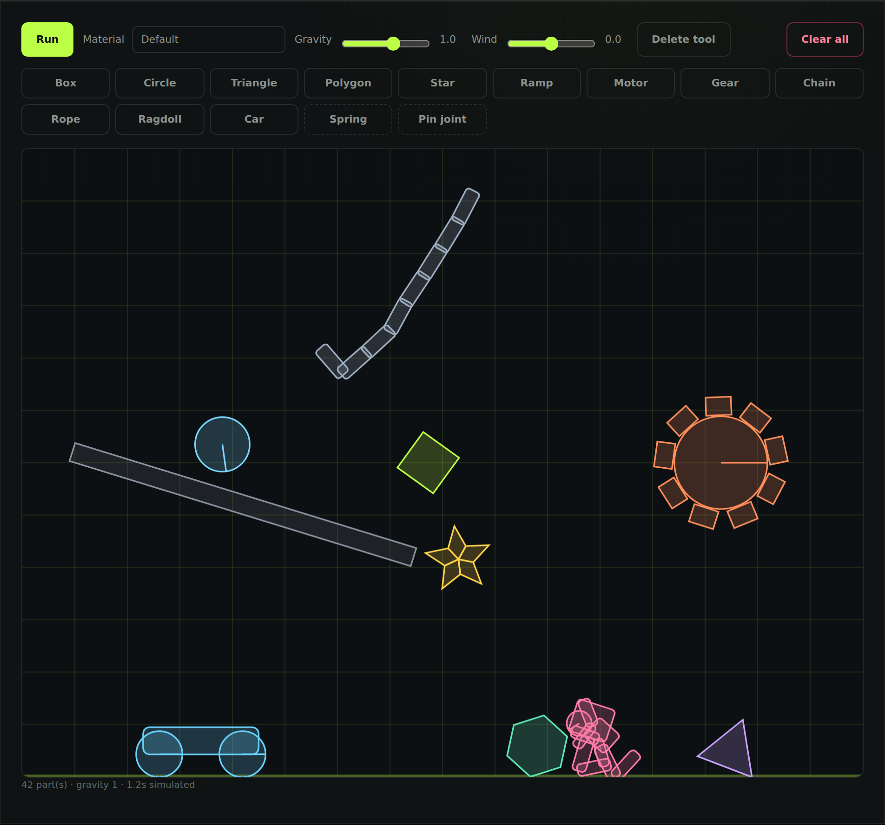
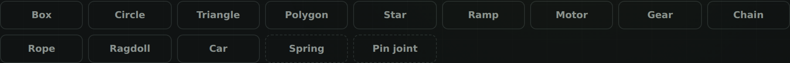

# Evolv now has a physics sandbox — and the AI can play in it

Evolv is a local-first AI chat that runs against your own Ollama models. This
update adds something that isn't chat at all: a 2D physics world you can build
things in, with an assistant that can build alongside you and actually *see*
what happened.

Type `/physics` in the chat box and it opens.

## Build something, press Run

Fourteen tools: box, circle, triangle, polygon, star, ramp, motor, gear, chain,
rope, ragdoll, car, plus spring and pin joints to tie things together.

Five materials — bouncy rubber, heavy metal, light wood, ice, and a middling
default — and they behave like their names. Rubber bounces about three times
higher than default. Metal is eight times heavier. A crate slides 279 pixels
down a ramp and stops; the same crate made of ice carries on to 774.

There's a gravity slider that goes negative, a wind slider that pushes
everything sideways, and you can grab anything and drag it around. Drag while
the simulation is running and things swing and knock each other over on the way
— objects are held by a soft constraint rather than welded to your cursor.
Pause first and dragging just places things precisely, which is what you want
when you're setting up an experiment rather than making a mess.

Click any object to read its mass, position and speed.

## The part that's actually new

You can ask Evolv to build things:

> Build a ramp at 20 degrees and roll a heavy ball down it, then tell me where
> it ended up.

It has five tools for this — one to look at the scene, one to add objects, one
to join two of them with a spring or a pin, one to advance time, and one to
change gravity, wind, or shove something. It builds the scene, runs it, reads
the result back, and answers you.

The looking matters as much as the building. Ask what's in the scene and it
gets real positions, velocities, masses, what's touching what, and whether
everything has settled — read from the simulation itself, not guessed.

## One decision worth explaining

The physics engine runs on the server, not in the browser page. That's an odd
choice for a thing you look at, and it came from asking what "what's in the
scene?" should mean.

If the simulation lived in the browser, that question would really mean "what
does some tab currently believe?" — and asking with no window open would get
you "the world is empty." Running it server-side means the world exists whether
or not anyone's watching, and the AI reads the same bodies the solver just
moved. The page receives already-solved polygons and draws them. It has no
physics of its own, so there's no second copy to disagree with the first.

It has a nice side effect: because time only advances when something asks for
it, at a fixed timestep, the same scene run twice gives identical results.
That's the difference between an experiment and an animation.

## Also in this build

- **The agent got room to work.** Tool call budgets went from 6 to 100. While
  raising it I found a hard-coded cap that had been silently overriding the
  configured budget, so the old number wasn't even doing what it claimed.
- Everything runs locally. No account, no telemetry, nothing leaves your
  machine unless you point it at a cloud provider yourself.

## Honest notes

The Windows build is **unsigned**, so SmartScreen will warn you — click **More
info → Run anyway**. Signing needs a certificate, which is a purchase, not a
code change.

The physics world is capped at 200 objects. It's a sandbox, not an engine — it
won't run your game.

And the AI side needs [Ollama](https://ollama.com) running with a model that
supports tool calling. Without it the sandbox still works fine by hand; you
just don't get an assistant in it.

## Get it

Grab the Windows build from the downloads above, unzip, run `Evolv.exe`.

Then type `/physics`, drop a ramp, drop a rubber ball above it, and press Run.
